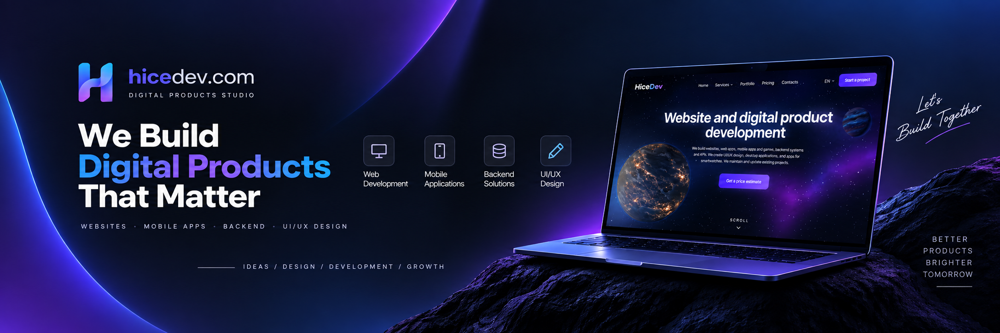

# HiceDev

### Digital products, designed and built with care.

[GitHub](https://github.com/hicedev) · [Instagram](https://www.instagram.com/hicedev_com/) · [Facebook](https://www.facebook.com/hicedev/) · [YouTube](https://www.youtube.com/@hicedev) · [TikTok](https://www.tiktok.com/@hicedev) · [X](https://x.com/hicedev_com) · [Behance](https://www.behance.net/hicedev)

<h2> About</h2>

HiceDev is a digital product studio. We design and build websites, web and mobile applications, games, backend systems, and APIs. We also help existing products stay fast, current, and useful.

<h2> What we do</h2>

- Website development
- Web and mobile applications
- UI/UX design
- Backend systems and APIs
- Games and interactive experiences
- Desktop and smartwatch applications
- Product maintenance and development

<h2> Technology</h2>

`TypeScript` · `React` · `Next.js` · `Node.js` · `Prisma` · `Tailwind CSS` · `Three.js`

<h2> Contact</h2>

- Email: [info@hicedev.com](mailto:info@hicedev.com)
- Telegram: [@hicedev_manager](https://t.me/hicedev_manager)

Made by [HiceDev](https://github.com/hicedev)

